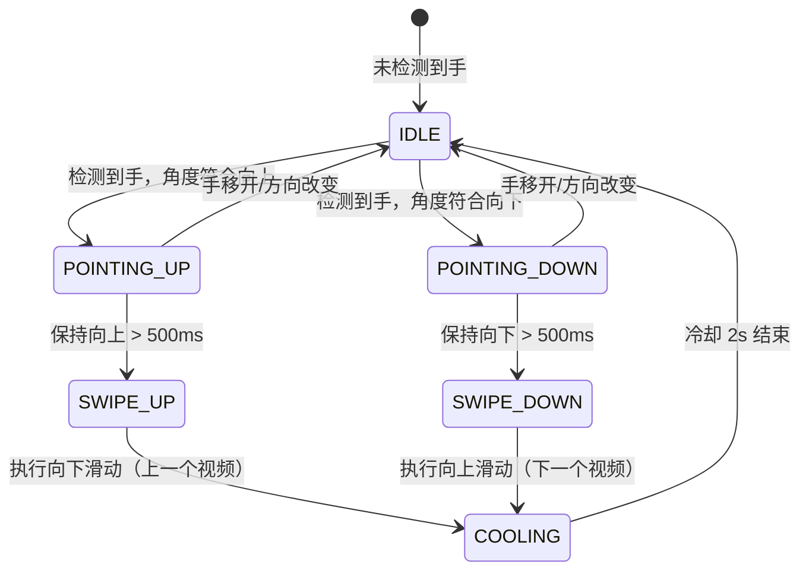
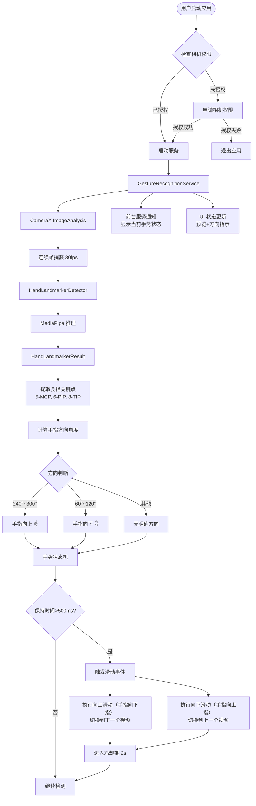

# lazyeat-kt 开发文档

## 1. 项目简介

### 1.1 项目定位

**lazyeat-kt** 是一个 Android 手势控制助手，专为**吃饭时刷抖音**设计。通过前置摄像头实时识别手部关键点，检测手指指向方向，实现免接触的手势滑动控制：

- **☝️ 手指向上指** → 向下滑动 → 切换到**上一个视频**
- **👇 手指向下指** → 向上滑动 → 切换到**下一个视频**

> **注意**：抖音的滑动逻辑与手势方向相反（向上滑显示下一个视频），因此手指向下指会触发向上滑动来切换到下一个视频。

### 1.2 目标场景

| 场景 | 痛点 | 解决方案 |
|------|------|----------|
| 吃饭刷抖音 | 手上有油，不想碰屏幕 | 隔空手势控制上下切换 |
| 吃炸鸡/小龙虾 | 手指脏了无法触控 | 手势识别自动翻页 |
| 做饭时看教程 | 手湿/有食材残渣 | 无接触浏览视频 |

### 1.3 当前能力边界

**已实现 ✅**

| 功能 | 实现状态 | 实现文件 |
|------|----------|----------|
| 实时手部关键点检测 | ✅ 已实现 | `HandLandmarkerDetector.kt` |
| 食指方向识别（角度计算） | ✅ 已实现 | `GestureRecognitionService.kt` |
| 手势语义判断（向上/向下） | ✅ 已实现 | `GestureRecognitionService.kt` |
| 手势状态机管理 | ✅ 已实现 | `GestureRecognitionService.kt` |
| 防抖与冷却机制 | ✅ 已实现 | `GestureRecognitionService.kt` |
| 滑动事件广播发送 | ✅ 已实现 | `GestureRecognitionService.kt` |
| 滑动事件接收与执行 | ✅ 已实现 | `SwipeAccessibilityService.kt` |
| 手势方向可视化 | ✅ 已实现 | `HandOverlayView.kt` |
| 前台服务保活机制 | ✅ 已实现 | `GestureRecognitionService.kt` |
| 辅助功能服务 | ✅ 已实现 | `SwipeAccessibilityService.kt` |

**待实现/扩展 📋**

| 功能 | 优先级 | 说明 |
|------|--------|------|
| 左右滑动支持 | 中 | 点赞、评论展开 |
| 捏合手势（缩放） | 低 | 视频缩放控制 |
| 自定义手势灵敏度 | 中 | 在 UI 中调节参数 |
| 多手支持 | 低 | 双手操作模式 |
| 其他短视频应用适配 | 低 | 快手、视频号等 |

---

## 2. 技术栈与版本

### 2.1 版本信息

| 组件 | 版本 | 用途 |
|------|------|------|
| Kotlin | 2.0.21 | 开发语言 |
| AGP | 8.9.1 | Android Gradle Plugin |
| Compile SDK | 35 | 编译目标 |
| Min SDK | 30 | 最低支持 Android 11 |
| Target SDK | 35 | 目标平台 |
| CameraX | 1.3.1 | 相机图像捕获 |
| MediaPipe | 0.10.8 | 手部关键点检测 |
| Lifecycle Service | 2.7.0 | 前台服务生命周期管理 |

### 2.2 核心依赖

```kotlin
// app/build.gradle.kts
implementation("androidx.camera:camera-core:1.3.1")
implementation("androidx.camera:camera-camera2:1.3.1")
implementation("androidx.camera:camera-lifecycle:1.3.1")
implementation("com.google.mediapipe:tasks-vision:0.10.8")
implementation("androidx.lifecycle:lifecycle-service:2.7.0")
```

---

## 2. 技术栈与版本

| 组件 | 版本 | 用途 |
|------|------|------|
| Kotlin | 2.0.21 | 开发语言 |
| AGP | 8.9.1 | Android Gradle Plugin |
| Compile SDK | 35 | 编译目标 |
| Min SDK | 30 | 最低支持 Android 11 |
| Target SDK | 35 | 目标平台 |
| CameraX | 1.3.1 | 相机图像捕获 |
| MediaPipe | 0.10.8 | 手部关键点检测 |
| Lifecycle Service | 2.7.0 | 前台服务生命周期管理 |

---

## 3. 手势识别原理

### 3.1 手指方向判断

使用食指的 **掌指关节(MCP)**、**近端指间关节(PIP)**、**指尖(TIP)** 三个关键点判断指向方向：

```
关键点索引（MediaPipe 定义）：
- 5: 食指掌指关节 (Index Finger MCP)
- 6: 食指近端指间关节 (Index Finger PIP)
- 8: 食指指尖 (Index Finger TIP)

方向判断逻辑（Android 屏幕坐标系：y 向下增加）：
1. 计算指尖到近端指间关节 (PIP) 的向量角度
2. 角度 240°~300° → 向上指 ☝️（指尖在关节上方，对应 atan2 约 270°）
3. 角度 60°~120° → 向下指 👇（指尖在关节下方，对应 atan2 约 90°）
4. 其他角度 → 无明确方向
```

### 3.2 手势状态机



---

## 4. 架构说明

### 4.1 整体架构

```
┌─────────────────────────────────────────────────────────────┐
│                        UI 层                                 │
│  ┌─────────────┐  ┌─────────────────┐  ┌─────────────────┐   │
│  │MainActivity │  │  HomeFragment   │  │ HandOverlayView │   │
│  │ (权限/导航)  │  │ (控制/状态显示)  │  │ (关键点+方向绘制)│   │
│  └──────┬──────┘  └────────┬────────┘  └─────────────────┘   │
└─────────┼──────────────────┼────────────────────────────────┘
          │                  │
          ▼                  ▼
┌─────────────────────────────────────────────────────────────┐
│                      服务层                                  │
│  ┌─────────────────────────────────────────────────────────┐│
│  │            GestureRecognitionService                     ││
│  │              (手势识别前台服务)                           ││
│  │  • CameraX 图像分析 (30fps)                              ││
│  │  • MediaPipe 手部检测                                    ││
│  │  • 食指方向计算 (MCP→PIP→TIP)                            ││
│  │  • 手势状态机管理                                         ││
│  │  • 滑动事件注入/触发                                      ││
│  │  • 冷却计时器                                            ││
│  └─────────────────────────────────────────────────────────┘│
└─────────────────────────────────────────────────────────────┘
```

### 4.2 模块职责

| 模块 | 职责 | 核心文件 | 实现状态 |
|------|------|----------|----------|
| **权限管理** | 相机权限申请与检查 | `MainActivity.kt` | ✅ 已实现 |
| **手势识别** | 前台服务管理相机，实时检测手部关键点 | `GestureRecognitionService.kt` | ✅ 已实现 |
| **检测引擎** | MediaPipe 模型加载与推理 | `HandLandmarkerDetector.kt` | ✅ 已实现 |
| **可视化** | 绘制手部关键点、手指方向指示 | `HandOverlayView.kt` | ✅ 已实现 |
| **服务管理** | 服务启动/停止/状态查询封装 | `ServiceManager.kt` | ✅ 已实现 |
| **UI 控制** | 服务控制按钮、日志等级选择 | `HomeFragment.kt` | ✅ 已实现 |
| **手势语义** | 方向判断、状态机、防抖处理 | `GestureRecognitionService.kt` | ✅ 已实现 |
| **滑动执行** | 接收广播并执行系统滑动 | `SwipeAccessibilityService.kt` | ✅ 已实现 |

### 4.3 文件目录结构（已更新）

```
lazyeat-kt/
├── app/src/main/
│   ├── AndroidManifest.xml              # ✅ 已更新：移除悬浮窗权限，添加辅助功能服务
│   ├── java/com/lanxiuyun/lazyeat/
│   │   ├── MainActivity.kt              # ✅ 已修改：移除悬浮窗权限检查
│   │   ├── HandLandmarkerDetector.kt    # ✅ 已实现：MediaPipe 手部检测
│   │   ├── HandOverlayView.kt           # ✅ 已修改：添加方向箭头绘制
│   │   ├── service/
│   │   │   ├── GestureRecognitionService.kt  # ✅ 已重写：添加方向识别和状态机
│   │   │   ├── SwipeAccessibilityService.kt    # ✅ 已新建：滑动事件执行
│   │   │   └── ServiceManager.kt               # ✅ 已实现：服务管理
│   │   └── ui/home/
│   │       ├── HomeFragment.kt          # ✅ 已实现：UI 控制
│   │       └── HomeViewModel.kt         # ✅ 已存在
│   └── res/
│       ├── xml/accessibility_service_config.xml  # ✅ 已新建：辅助功能配置
│       └── values/strings.xml                      # ✅ 已更新：添加服务描述
└── DEVELOPMENT.md                       # ✅ 已更新：本文档
```

---

## 5. 关键数据流



---

## 6. 运行与调试

### 6.1 必要权限

| 权限 | 用途 | 申请时机 |
|------|------|----------|
| `CAMERA` | 手部图像捕获 | 应用启动时 |
| `POST_NOTIFICATIONS` (Android 13+) | 前台服务通知 | 应用启动时 |
| `FOREGROUND_SERVICE` | 保持服务运行 | Manifest 声明 |
| `FOREGROUND_SERVICE_CAMERA` | 相机前台服务类型 | Manifest 声明 |
| `BIND_ACCESSIBILITY_SERVICE` | 滑动事件注入（待实现） | 引导用户手动开启 |

### 6.2 启动流程

1. **应用启动** → 检查相机权限
2. **权限获取** → 自动启动 `GestureRecognitionService`
3. **服务启动** → 初始化 CameraX 和 MediaPipe
4. **手势检测** → 检测食指方向
5. **方向判断** → 向上指/向下指/无方向
6. **滑动触发** → 保持手势 500ms 后触发滑动
7. **冷却期** → 触发后 2s 内不再响应新手势

### 6.3 调试配置

#### 日志等级设置

在 Home 页面通过 Spinner 选择日志等级：

- `VERBOSE` (2): 每帧处理信息，包含角度计算
- `DEBUG` (3): 手势状态变更、方向判断
- `INFO` (4): 滑动触发、冷却状态，默认等级
- `WARN` (5): 异常警告
- `ERROR` (6): 错误信息

#### 关键日志标签

```bash
# 查看手势识别服务
adb logcat -s GestureRecognitionService:D

# 查看角度计算
adb logcat -s GestureRecognizer:D

# 查看所有模块
adb logcat -s lazyeat:D
```

### 6.4 常见故障排查

| 问题 | 可能原因 | 解决方案 |
|------|----------|----------|
| 无法识别手势 | 相机权限被拒绝 | 检查设置中相机权限已开启 |
| 方向识别不准 | 手部姿势不正确 | 伸直食指，保持 MCP→PIP→TIP 三点可见 |
| 误触发频繁 | 手势保持时间过短 | 在设置中增加"保持时间"阈值 |
| 滑动不响应 | AccessibilityService 未开启 | 在系统设置中开启辅助功能权限 |
| 手势延迟高 | 光线不足 | 改善光照条件，避免背光 |

---

## 7. 关键参数与可调项

### 7.1 手势识别参数

文件: `GestureRecognitionService.kt`

```kotlin
// 方向角度阈值（度数）- 基于 Android 屏幕坐标系（y向下增加）
// 手指向上指时 tip.y < pip.y，atan2 角度约 270°
// 手指向下指时 tip.y > pip.y，atan2 角度约 90°
object DirectionThresholds {
    const val UP_MIN = 240f     // 向上最小角度
    const val UP_MAX = 300f     // 向上最大角度
    const val DOWN_MIN = 60f    // 向下最小角度
    const val DOWN_MAX = 120f   // 向下最大角度
}

// 手势保持时间（毫秒）- 越小越灵敏
const val GESTURE_HOLD_TIME = 150L

// 冷却时间（毫秒）
const val COOLDOWN_TIME = 800L

// 防抖阈值：连续 N 帧一致才确认方向变更
const val DEBOUNCE_FRAMES = 3
```

### 7.2 相机配置

文件: `GestureRecognitionService.kt`

```kotlin
// 图像分析配置
ImageAnalysis.Builder()
    .setTargetAspectRatio(AspectRatio.RATIO_4_3)
    .setBackpressureStrategy(ImageAnalysis.STRATEGY_KEEP_ONLY_LATEST)
    .setOutputImageFormat(ImageAnalysis.OUTPUT_IMAGE_FORMAT_RGBA_8888)
```

### 7.3 滑动事件配置

```kotlin
// 滑动距离（像素）
const val SWIPE_DISTANCE = 800

// 滑动持续时间（毫秒）
const val SWIPE_DURATION = 300L
```

---

## 8. 实现指南

### 8.1 手势方向识别（已实现 ✅）

**实现文件**: `GestureRecognitionService.kt` (第 298-345 行)

核心逻辑：

```kotlin
/**
 * 计算食指指向方向
 * @return 角度（0-360度），-1 表示无法计算
 */
private fun calculateFingerDirection(landmarks: List<NormalizedLandmark>): Float {
    val mcp = landmarks[5]  // 掌指关节
    val pip = landmarks[6]  // 近端指间关节  
    val tip = landmarks[8]  // 指尖
    
    // 使用 PIP→TIP 向量计算方向（更稳定）
    val dx = tip.x() - pip.x()
    val dy = tip.y() - pip.y()
    
    // 计算角度（atan2 返回弧度，转换为度数）
    val angleRad = atan2(dy, dx)
    var angleDeg = Math.toDegrees(angleRad.toDouble()).toFloat()
    
    // 归一化到 0-360
    if (angleDeg < 0) angleDeg += 360f
    
    return angleDeg
}

/**
 * 判断手势方向
 */
private fun detectGestureDirection(angle: Float): GestureDirection {
    // Android 屏幕坐标系：y 向下增加
    // 手指向上指时，tip.y < pip.y，atan2 角度约 270°
    // 手指向下指时，tip.y > pip.y，atan2 角度约 90°
    return when (angle) {
        in 240f..300f -> GestureDirection.UP     // 向上（对应屏幕上方实际手指向上）
        in 60f..120f -> GestureDirection.DOWN    // 向下（对应屏幕下方实际手指向下）
        else -> GestureDirection.NONE            // 无明确方向
    }
}
```

### 8.2 手势状态机（已实现 ✅）

**实现文件**: `GestureRecognitionService.kt` (第 95-196 行，内部类 `GestureStateMachine`)

完整实现：
```kotlin
enum class GestureState {
    IDLE,           // 空闲
    POINTING_UP,    // 向上指
    POINTING_DOWN,  // 向下指
    SWIPING_UP,     // 正在上滑
    SWIPING_DOWN,   // 正在下滑
    COOLING         // 冷却中
}

class GestureStateMachine {
    private var currentState = GestureState.IDLE
    private var gestureStartTime = 0L
    private var lastTriggerTime = 0L
    private val debounceCounter = mutableMapOf<GestureDirection, Int>()
    
    fun process(direction: GestureDirection): GestureAction {
        val now = System.currentTimeMillis()
        
        // 防抖检查
        if (!debounce(direction)) return GestureAction.NONE
        
        return when (currentState) {
            GestureState.IDLE -> when (direction) {
                GestureDirection.UP -> {
                    currentState = GestureState.POINTING_UP
                    gestureStartTime = now
                    GestureAction.START_TRACKING
                }
                GestureDirection.DOWN -> {
                    currentState = GestureState.POINTING_DOWN
                    gestureStartTime = now
                    GestureAction.START_TRACKING
                }
                else -> GestureAction.NONE
            }
            
            GestureState.POINTING_UP -> when (direction) {
                GestureDirection.UP -> {
                    // 检查保持时间
                    if (now - gestureStartTime > GESTURE_HOLD_TIME) {
                        currentState = GestureState.SWIPING_UP
                        GestureAction.TRIGGER_SWIPE_UP
                    } else {
                        GestureAction.CONTINUE_TRACKING
                    }
                }
                else -> {
                    currentState = GestureState.IDLE
                    GestureAction.CANCEL_TRACKING
                }
            }
            
            GestureState.SWIPING_UP -> {
                currentState = GestureState.COOLING
                lastTriggerTime = now
                GestureAction.SWIPE_UP_COMPLETED
            }
            
            GestureState.COOLING -> {
                if (now - lastTriggerTime > COOLDOWN_TIME) {
                    currentState = GestureState.IDLE
                }
                GestureAction.NONE
            }
            
            // ... POINTING_DOWN, SWIPING_DOWN 类似
        }
    }
}
```

### 8.3 滑动事件注入（已实现 ✅）

**实现文件**: `SwipeAccessibilityService.kt` (完整文件)

采用方案：AccessibilityService + 广播接收

**配置步骤**：
1. 在系统设置 → 辅助功能 → 已安装服务 → 找到"吃饭刷抖音助手"
2. 开启辅助功能服务
3. 授予手势执行权限

**核心实现**：

```kotlin
class SwipeAccessibilityService : AccessibilityService() {
    
    fun performSwipeUp() {
        val displayMetrics = resources.displayMetrics
        val centerX = displayMetrics.widthPixels / 2
        val centerY = displayMetrics.heightPixels / 2
        
        val path = Path().apply {
            moveTo(centerX.toFloat(), centerY + 400f)
            lineTo(centerX.toFloat(), centerY - 400f)
        }
        
        val gesture = GestureDescription.Builder()
            .addStroke(GestureDescription.StrokeDescription(path, 0, 300))
            .build()
            
        dispatchGesture(gesture, null, null)
    }
    
    fun performSwipeDown() {
        // 类似实现，方向相反
    }
}
```

方案 B：发送系统广播（需要系统签名）

```kotlin
// 通过广播触发系统滑动（需要特殊权限）
val intent = Intent("com.android.systemui.SWIPE_GESTURE").apply {
    putExtra("direction", "up")  // or "down"
}
sendBroadcast(intent)
```

---

## 9. 测试现状

### 9.1 当前测试覆盖

| 类型 | 覆盖情况 | 说明 |
|------|----------|------|
| 单元测试 | ⚠️ 空白 | 仅存在示例测试 |
| 集成测试 | ⚠️ 空白 | 需补充手势识别测试 |
| UI 测试 | ❌ 无 | 需补充 Espresso 测试 |
| 性能测试 | ❌ 无 | 需补充帧率/延迟测试 |

### 9.2 建议补测项

#### 高优先级

1. **手势识别准确性测试**
   - 不同角度（60°-向下、90°-向下、120°-向下、240°-向上、270°-向上、300°-向上）的识别率
   - 不同距离（20cm、50cm、80cm）的检测成功率
   - 不同光照条件（明亮、昏暗、逆光）的稳定性

2. **滑动触发测试**
   - 保持时间与触发成功率的关系
   - 冷却时间是否有效防止误触发
   - 快速连续手势的处理

3. **防抖机制测试**
   - 抖动情况下的方向稳定性
   - 手掌微动时的抗干扰能力

#### 中优先级

4. **性能基准测试**
   - FPS 稳定性（目标 30fps）
   - 端到端延迟（手势到滑动的时间）
   - 电池消耗评估

5. **兼容性测试**
   - 不同 Android 版本的兼容性
   - 不同设备前置摄像头的适配

---

## 10. 文件目录结构

```
lazyeat-kt/
├── app/
│   ├── src/
│   │   ├── main/
│   │   │   ├── AndroidManifest.xml      # 权限与服务声明
│   │   │   ├── assets/
│   │   │   │   └── hand_landmarker.task  # MediaPipe 模型文件
│   │   │   ├── java/com/lanxiuyun/lazyeat/
│   │   │   │   ├── MainActivity.kt       # 主入口/权限管理
│   │   │   │   ├── HandLandmarkerDetector.kt  # 手部检测引擎
│   │   │   │   ├── HandOverlayView.kt    # 手部可视化+方向指示
│   │   │   │   ├── service/
│   │   │   │   │   ├── GestureRecognitionService.kt  # 手势识别服务
│   │   │   │   │   │   ├── 方向计算
│   │   │   │   │   │   ├── 状态机管理
│   │   │   │   │   │   └── 滑动触发
│   │   │   │   │   ├── ServiceManager.kt             # 服务管理
│   │   │   │   │   └── SwipeAccessibilityService.kt  # 滑动注入服务（待实现）
│   │   │   │   ├── ui/home/
│   │   │   │   │   ├── HomeFragment.kt   # 主界面 Fragment
│   │   │   │   │   └── HomeViewModel.kt  # 视图模型
│   │   │   │   └── utils/
│   │   │   │       └── LogUtils.kt       # 日志工具
│   │   │   └── res/                      # 布局、资源文件
│   │   ├── test/                         # 单元测试目录
│   │   └── androidTest/                  # 集成测试目录
│   └── build.gradle.kts                  # 应用级构建配置
├── gradle/libs.versions.toml             # 依赖版本管理
├── build.gradle.kts                      # 项目级构建配置
└── settings.gradle.kts                   # 项目设置
```

---

## 11. 快速开始

### 11.1 环境要求

- Android Studio Ladybug 或更高版本
- JDK 17+
- Android 设备或模拟器（API 30+）
- 设备需有前置摄像头

### 11.2 构建步骤

```bash
# 1. 克隆项目
git clone <repository-url>
cd lazyeat-kt

# 2. 使用 Gradle 构建
./gradlew assembleDebug

# 3. 安装到设备
./gradlew installDebug
```

### 11.3 使用说明

#### 首次设置

1. **开启相机权限**
   - 应用首次启动时会自动申请

2. **开启辅助功能（关键步骤）**
   - 系统设置 → 辅助功能 → 已安装服务 → 吃饭刷抖音助手 → 开启
   - 此步骤用于执行系统滑动操作

#### 日常使用

1. **打开抖音**
   - 确保抖音在前台运行

2. **启动手势服务**
   - 打开 lazyeat 应用
   - 点击"启动手势识别服务"
   - 出现"服务运行中"通知即表示成功

3. **使用手势控制**
   - 将手放在前置摄像头前，距离 30-50cm
   - **伸直食指** ☝️ **向上指** 保持 0.5 秒 → **切换到上一个视频**
   - **伸直食指** 👇 **向下指** 保持 0.5 秒 → **切换到下一个视频**
   - 每次触发后有 2 秒冷却期（防止误触发）

4. **查看状态**
   - 屏幕上方会显示当前手势方向和状态
   - 绿色箭头 = 向上，红色箭头 = 向下

#### 辅助功能开启问题

**问题：每次打开应用都要重新开启辅助功能？**

这是某些厂商系统（小米 MIUI、OPPO ColorOS、华为 HarmonyOS）的安全机制，解决方法：

1. **选择"不再询问"**
   - 在引导对话框中选择"不再询问"
   - 手动在系统设置中开启辅助功能后，应用不会再提示

2. **系统设置优化**（可选）
   - 设置 → 应用管理 → 吃饭刷抖音助手 → 允许自启动
   - 设置 → 电池优化 → 吃饭刷抖音助手 → 不优化
   - 设置 → 权限管理 → 吃饭刷抖音助手 → 允许后台运行

3. **ADB 强制设置**（开发者）
   ```bash
   adb shell settings put secure enabled_accessibility_services com.lanxiuyun.lazyeat/com.lanxiuyun.lazyeat.service.SwipeAccessibilityService
   ```

#### 调整参数（可选）

如需调整灵敏度，修改 `GestureRecognitionService.kt` 中的常量：

```kotlin
// 手势保持时间（毫秒）- 越小越灵敏
const val GESTURE_HOLD_TIME = 150L

// 冷却时间（毫秒）- 越小可连续操作越快
const val COOLDOWN_TIME = 800L

// 防抖帧数 - 越小越灵敏但可能误触
const val DEBOUNCE_FRAMES = 3
```

### 11.4 开发调试

```bash
# 查看手势识别日志
adb logcat -s GestureRecognitionService:D

# 查看辅助功能服务日志
adb logcat -s SwipeAccessibilityService:D

# 查看主界面日志
adb logcat -s MainActivity:D

# 查看所有相关日志
adb logcat -s GestureRecognitionService:D,SwipeAccessibilityService:D,MainActivity:D

# 检查辅助功能是否开启
adb shell settings get secure enabled_accessibility_services

# 强制开启辅助功能（调试用）
adb shell settings put secure enabled_accessibility_services com.lanxiuyun.lazyeat/com.lanxiuyun.lazyeat.service.SwipeAccessibilityService

# 清除应用数据（重置权限）
adb shell pm clear com.lanxiuyun.lazyeat

# 测试滑动（调试用）
adb shell input swipe 500 1500 500 700 300  # 向上滑
adb shell input swipe 500 700 500 1500 300   # 向下滑
```

---

## 附录：核心类参考

### A.1 GestureRecognitionService

| 方法 | 说明 |
|------|------|
| `onCreate()` | 初始化相机执行器、手势识别器、通知通道 |
| `onStartCommand()` | 启动前台服务，开始相机捕获 |
| `startCamera()` | 配置并启动 CameraX 图像分析 |
| `processImageProxy()` | 处理每帧图像，调用 MediaPipe 检测 |
| `calculateFingerDirection()` | 计算食指指向角度 |
| `performSwipeUp/Down()` | 执行滑动（三层方案） |
| `tryInjectSwipe()` | 反射注入触摸事件 |
| `tryShellSwipe()` | Shell 命令模拟滑动 |
| `GestureStateMachine` | 手势状态机（防抖、冷却） |
| `updateNotification()` | 更新前台服务通知内容 |

### A.2 HandLandmarkerDetector

| 方法 | 说明 |
|------|------|
| `initialize()` | 从 assets 复制模型，初始化 MediaPipe |
| `detect()` | 异步检测 Bitmap 中的手部关键点 |
| `release()` | 释放 MediaPipe 资源 |

### A.3 HandOverlayView

| 方法 | 说明 |
|------|------|
| `setResults()` | 设置手部识别结果并绘制关键点 |
| `setGestureInfo()` | 设置手势方向和状态 |
| `drawDirectionArrow()` | 绘制手指方向箭头指示 |
| `drawStatusInfo()` | 绘制状态文字 |

### A.4 SwipeAccessibilityService

| 方法 | 说明 |
|------|------|
| `onServiceConnected()` | 服务连接，注册广播接收器 |
| `onUnbind()` | 服务解绑回调 |
| `performSwipeUp()` | 执行向上滑动 |
| `performSwipeDown()` | 执行向下滑动 |
| `swipeReceiver` | 广播接收器，接收滑动指令 |

### A.5 MainActivity

| 方法 | 说明 |
|------|------|
| `checkAndRequestAccessibility()` | 检查并引导开启辅助功能 |
| `isAccessibilityServiceEnabled()` | 检测辅助功能是否开启 |
| `openAccessibilitySettings()` | 打开辅助功能设置页面 |
| `startGestureService()` | 启动手势识别服务 |

---

## 变更日志

### v2.2 (2026-03-22) - 修复滑动方向

**问题修复**:
- 🐛 修复：滑动方向映射错误。手指向下指现在正确触发向上滑动（切换到下一个视频），手指向上指触发向下滑动（切换到上一个视频）

### v2.1 (2026-03-22) - 修复与优化

**问题修复**:
- 🐛 修复：`GestureStateMachine` 内部类不能使用 `companion object` 的编译错误
- 🐛 修复：`MainActivity` 字符串中使用中文引号导致的编译错误
- 🐛 修复：`GestureRecognitionService` 缺少 `SystemClock` 导入
- 🐛 修复：广播发送添加 `setPackage()` 以确保 Android 12+ 能正确接收
- 🐛 修复：辅助功能状态变量移到 `companion object` 以便外部访问

**功能优化**:
- ✨ 优化：`MainActivity` 添加"不再询问"选项，避免重复打扰
- ✨ 优化：改进辅助功能检测逻辑，支持多种服务名称格式
- ✨ 优化：辅助功能服务配置添加更多标志位，提高稳定性
- ✨ 优化：滑动执行添加三层方案（广播 → 反射 → Shell）
- ✨ 优化：`SwipeAccessibilityService` 添加服务生命周期日志

**已知限制**:
- ⚠️ 某些厂商系统（MIUI、ColorOS、HarmonyOS）会在应用更新后重置辅助功能权限
- ⚠️ 直接注入触摸事件需要系统签名或 root 权限
- ⚠️ Shell 命令滑动需要 root 权限

### v2.0 (2026-03-22) - 需求变更完成

**重大变更**:
- ❌ 移除：悬浮鼠标指针功能
- ❌ 移除：`MousePointerService.kt`
- ✅ 新增：手势方向识别（向上/向下）
- ✅ 新增：手势状态机（防抖、冷却机制）
- ✅ 新增：`SwipeAccessibilityService.kt`
- ✅ 新增：广播通信机制
- ✅ 修改：`GestureRecognitionService.kt` - 重写手势处理逻辑
- ✅ 修改：`HandOverlayView.kt` - 添加方向箭头绘制
- ✅ 修改：`MainActivity.kt` - 移除悬浮窗权限，添加辅助功能引导
- ✅ 修改：`AndroidManifest.xml` - 添加辅助功能服务声明

**实现统计**:
- 修改文件：6 个
- 新建文件：2 个
- 删除文件：2 个
- 新增代码行数：约 600 行

---

## 附录：故障排查

### 辅助功能开启后滑动仍无效

**排查步骤：**

1. **检查广播是否发送**
   ```bash
   adb logcat -s GestureRecognitionService:D | grep "已发送"
   ```
   应看到："已发送上滑广播到包: com.lanxiuyun.lazyeat"

2. **检查广播是否接收**
   ```bash
   adb logcat -s SwipeAccessibilityService:D | grep "接收到"
   ```
   应看到："接收到滑动广播: direction=up"

3. **检查服务是否连接**
   ```bash
   adb logcat -s SwipeAccessibilityService:D | grep "已连接"
   ```
   应看到："滑动辅助功能服务已连接"

**可能原因：**
- 辅助功能虽然显示开启，但服务未实际运行（部分系统需要重启服务）
- 广播被系统拦截（Android 12+ 需要明确指定包名，已修复）
- 应用被电池优化限制，后台服务被杀死

**解决方案：**
1. 关闭辅助功能后重新开启
2. 重启应用
3. 检查系统设置中的电池优化和自启动权限

### 手势方向识别不准

**排查：**
- 确保食指伸直，其他手指自然弯曲
- 手部距离摄像头 30-50cm
- 确保光线充足，避免逆光
- 背景不要太复杂

### 滑动方向映射说明

抖音的滑动逻辑：
- **向上滑动**（手指从屏幕下方向上滑）→ 切换到**下一个视频**
- **向下滑动**（手指从屏幕上方往下滑）→ 切换到**上一个视频**

本应用的手势映射（符合直觉）：
- **手指向下指** 👇（想看下一个视频）→ 触发**向上滑动** → 切换到**下一个视频**
- **手指向上指** ☝️（想看上一个视频）→ 触发**向下滑动** → 切换到**上一个视频**

**实现说明**：由于抖音的滑动逻辑与手势方向相反（向下指却需要向上滑），`GestureRecognitionService.kt` 中的 `handleGestureAction()` 方法进行了相应的映射转换。

---

*文档版本: 2.2*  
*最后更新: 2026-03-22*  
*需求变更: 从悬浮鼠标改为手势滑动控制*
